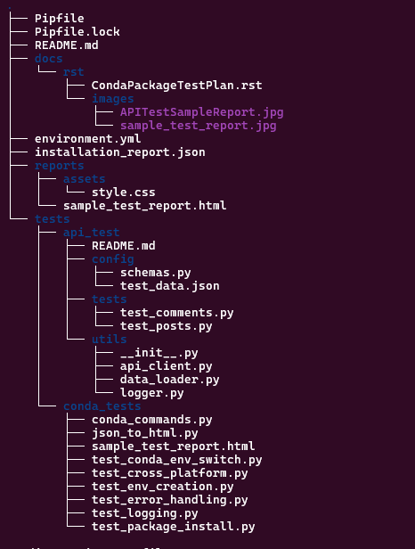

# API and Conda Automation Testing Framework
streamlined testing framework for automating Conda environment setup and API validation using Pytest. It ensures cross-platform compatibility, efficient package management, and robust API testing with logging, reporting, and error handling.

## Project Overview
This repository contains an automation framework for **API testing** and **Conda package management**, designed with **pytest** and **requests** for API validation, and Conda scripting for environment handling. It ensures **cross-platform compatibility**, **installation verification**, and **test execution reporting**.

## Intended Goals
- **Automate API testing** using pytest.
- **Validate JSON responses** with `jsonschema`.
- **Ensure Conda package compatibility** across Linux, Windows, and macOS.
- **Capture installation logs and execution reports** for debugging.
- **Improve maintainability and modularity** for scalable testing.

---

## Project Structure



---

## ⚙️ Setup Instructions

### ** Conda Setup**
1. **Install Conda** (if not installed):
   ```bash
   curl -L -O https://repo.anaconda.com/miniconda/Miniconda3-latest-Linux-x86_64.sh
   bash Miniconda3-latest-Linux-x86_64.sh
   conda env create -f environment.yml
   conda activate test_env
   conda list

### Python & API Testing Setup
Install dependencies using Pipenv:

   ```bash
   pip install pipenv
   pipenv install

### Run API tests:
   ```bash
   pytest tests/api_test/tests/ -v --html=reports/api_test_report.html

### Run Conda package verification tests:

   ```bash
   pytest tests/conda_tests/ -v --html=reports/conda_test_report.html

