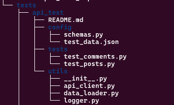

# API Automation Testing Framework

## Overview
This repository contains a **Python-based API automation testing framework** using `pytest` and the `requests` library. It validates API endpoints from [JSONPlaceholder](https://jsonplaceholder.typicode.com/), covering **CRUD operations and response integrity**.

## Features
- Modular framework with **clear separation of concerns**
- Base classes for **API interactions**
- **Structured test data management** with `test_data.json`
- **Logging and reporting mechanisms** for debugging
- **Test coverage for CRUD operations & validations**
- JSON schema validation using `jsonschema`

## Directory Structure


## Prerequisites
Ensure `Python 3.13+` is installed. Install dependencies using **Pipenv**:

```pip install pipenv
pipenv install```

### Running Tests
from the root directory.
```pipenv run pytest tests/api_test/. -v --html=reports/test_report.html

bash
pytest --html=reports/test_report.html
API Endpoints Tested
Endpoint	        Method	Description
/posts	            POST	Create a new post
/posts/1	        GET	    Retrieve a post
/posts/1	        PUT	    Update a post
/posts/1	        DELETE	Delete a post
/posts/1/comments	GET	    Retrieve comments for a post Validation

Response Status Codes 
JSON Schema Validation (jsonschema) 
Error Handling for Invalid Requests

